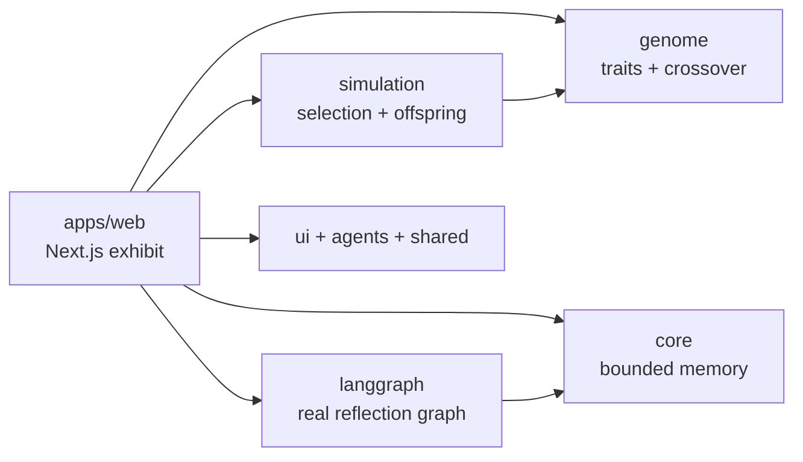
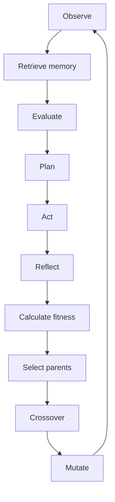

# Agent Genome

> **Watch an AI species evolve.**

Agent Genome is a browser-native interactive exhibit that makes evolutionary AI visible. Forty luminous digital organisms explore a minimal field. Each carries a genome that shapes its strategy; live resource collection, hazard avoidance, cooperation, and exploration produce fitness; then successful strategies are selected, crossed over, and mutated into a new cohort.


## What you can explore

- Observe 40 organisms moving through resources and hazards.
- Click an organism to inspect its genome, intent, reflection, fitness, and parent lineage.
- Pause, reset, spawn a fresh population, and tune mutation and simulation speed.
- Follow the cognitive loop: **Observe → Plan → Act → Reflect → Evolve**.
- Let the countdown finish to see a generation transition and emerging genetic drift.
- Optionally connect a real LLM reflection node using Ollama, LM Studio, OpenAI-compatible APIs, OpenAI, or Anthropic.

## The idea

Most AI products hide adaptation behind a score or a chat box. Agent Genome makes the mechanism inspectable. It distinguishes an agent's recent structured memory from the population-level evolution of strategies over generations. The experience is intentionally an exhibit, not a game and not an AI assistant.

## Quick start

### Prerequisites

- Node.js 18.17+ (Node 20+ recommended)
- npm 9+

```bash
git clone https://github.com/harishkotra/agent-genome.git
cd agent-genome
npm install
npm run dev --workspace=@agent-genome/web
```

Open [http://localhost:3000](http://localhost:3000). For a production build:

```bash
npm run build --workspace=@agent-genome/web
npm run start --workspace=@agent-genome/web
```

The exhibit is a Next.js App Router application. The interactive page is client-rendered; the optional `/api/reflect` route is server-rendered on demand. It deploys directly to Vercel, though a hosted deployment cannot reach an Ollama or LM Studio server running on your own computer.

## Technologies

| Area | Technology | Purpose |
| --- | --- | --- |
| App | Next.js 14, React 18, TypeScript | Typed browser-first exhibit |
| Workspace | Turborepo and npm workspaces | Reusable, separated domain modules |
| Renderer | Canvas 2D | Lightweight glow, trails, particles, and organism animation |
| Genetics | Custom TypeScript | Explicit 1–10 traits, crossover, and bounded mutation |
| Cognition | LangChain + LangGraph | Optional real reflection workflow for local and hosted models |
| 3D upgrade path | Three.js, React Three Fiber, Drei dependencies | Available for a future WebGL field |

## Architecture





### Repository map

```text
apps/web/                 Next.js interface, Canvas rendering, controls
packages/genome/          Trait types, clamping, crossover, mutation
packages/simulation/      Parent selection and generation construction
packages/core/            Capped structured agent memory
packages/agents/          Agent goal vocabulary
packages/langgraph/       LangGraph reflection workflow and LangChain provider adapters
packages/ui/              Genome colour tokens
packages/shared/          Simulation constants
docs/                     Architecture, technical deep dive, launch copy
```

## Evolution model

Traits are whole numbers from 1–10 so their meanings remain legible in the interface. A child inherits each trait from a parent, then may receive a one-step bounded mutation.

```ts
export function crossover(a: Genome, b: Genome, mutationRate = 0.08): Genome {
  const child = {} as Genome;

  for (const key of Object.keys(a) as GenomeTrait[]) {
    const inherited = Math.random() > 0.5 ? a[key] : b[key];
    const delta = Math.random() < mutationRate
      ? (Math.random() > 0.5 ? 1 : -1)
      : 0;
    child[key] = clampTrait(inherited + delta);
  }
  return child;
}
```

Selection ranks the population by fitness and uses the top 35% as a parent pool. Resources collected, movement toward exploration, hazard avoidance, and cooperation all contribute to the live fitness signal:

```ts
const elite = [...population]
  .sort((a, b) => b.fitness - a.fitness)
  .slice(0, Math.ceil(population.length * 0.35));

const parentA = elite[index % elite.length];
const parentB = elite[(index * 7 + 3) % elite.length];
```

## LLM providers and privacy

The simulation itself is deterministic and does **not** require an LLM. It is still an autonomous, rule-based evolutionary simulation when LLM reflection is disabled. Enable the **Optional LLM Reflection** panel, select an organism, and choose **Run Reflection** to call a real LangGraph workflow. The workflow receives the selected agent’s goal, fitness, structured recent memories, and genome; it returns a one-sentence reflection plus bounded `-1`, `0`, or `+1` suggestions for the permitted traits.

| Provider | Default endpoint | Example model |
| --- | --- | --- |
| Ollama | `http://localhost:11434` | `llama3.2` |
| LM Studio / OpenAI-compatible | `http://localhost:1234/v1` | your loaded model ID |
| OpenAI | provider default | `gpt-4o-mini` |
| Anthropic | provider default | `claude-3-5-haiku-latest` |

Keys are held only in the browser form state and sent for the one reflection request; they are not written to local storage or the repository. For local providers, run the Next app on the same machine. On hosted deployments, local `localhost` providers are naturally unavailable to the server runtime. LLM output is deliberately constrained: it cannot call tools, execute code, rewrite prompts, or modify rules outside the bounded genome adjustment payload.

## Memory model

This project does not use RAG, embeddings, a vector database, or a hidden persistent memory layer. Each agent owns an in-memory structured list of recent action outcomes, capped at 20 records:

```ts
export type Memory = {
  action: string;
  outcome: 'success' | 'failure';
  at: number;
};

export const remember = (memories: Memory[], memory: Memory) =>
  [...memories, memory].slice(-MAX_MEMORIES);
```

Those records give a reflection model evidence to reason about; they do not replace evolution. Evolution happens during parent selection, crossover, and mutation across the population.

## Develop and contribute

```bash
# Run the web app
npm run dev --workspace=@agent-genome/web

# Verify the production build
npm run build --workspace=@agent-genome/web

# Run workspace tasks through Turborepo
npm run build
```

To contribute, fork the repository, make a focused branch, and submit a pull request with a short explanation of the visible effect plus screenshots or a clip for visual work.

```bash
git checkout -b feat/mutation-replay
```

Keep genetics and selection in packages; keep visual interaction in `apps/web`. Run the production build before opening a PR. Avoid hidden state and heavy dependencies unless they materially improve the educational experience.

### Ideas worth building

- Mutation replay that highlights parent-to-child trait changes.
- Side-by-side comparison of Generation 1 and the current population.
- JSON genome export/import and seeded replay.
- Colour organisms by dominant trait.
- Resource respawning, richer hazard interactions, and stronger cooperation events.
- Keyboard selection, reduced-motion mode, and accessible simulation logs.
- A React Three Fiber renderer using the same simulation contract.

## Design principles

- Keep the field sparse: organisms are the subject.
- Prefer visible cause and effect over black-box “intelligence.”
- Keep trait changes bounded and inspectable.
- Aim for understanding within 30 seconds.
